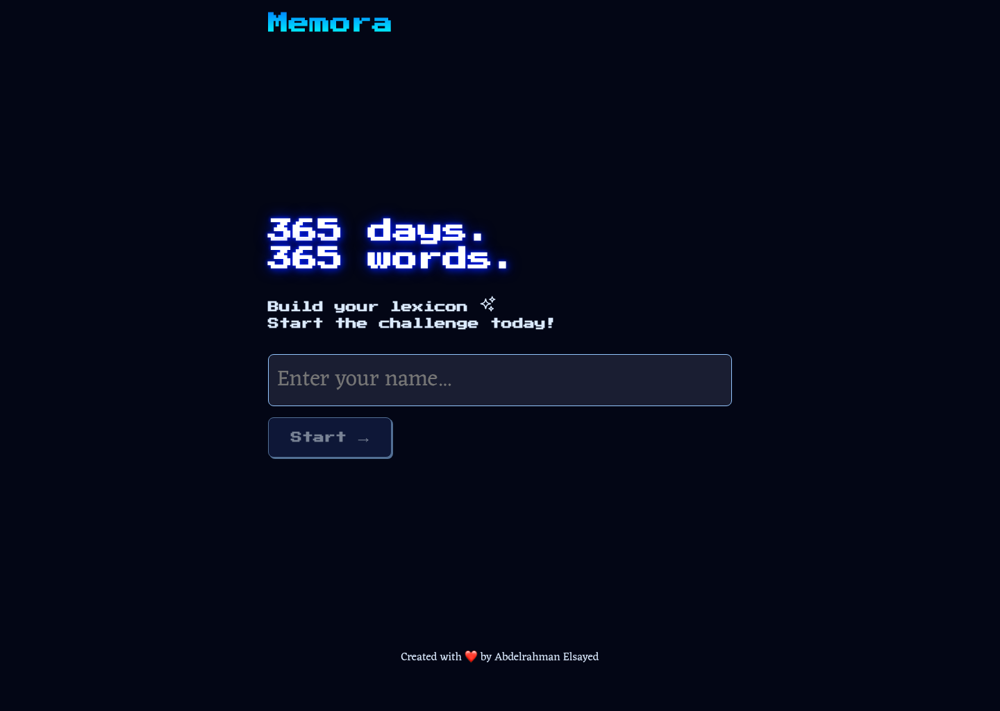

# Memora

A vocabulary learning app that uses spaced repetition to help you learn words better.

Try it live: [memoraaaaa.vercel.app](https://memoraaaaa.vercel.app/)



## Overview

Built with React and Vite, Memora helps you remember words for a long time. Each day you see new words and review old ones.

## What You Get

- **Daily Challenges** - Test your vocabulary each day
- **Spaced Repetition** - Review words at the right times to remember them
- **Progress Tracking** - See your learning streaks and statistics
- **24-Hour Timer** - A countdown that helps you stay motivated
- **Score Dashboard** - View your results and progress
- **Local Saving** - Your progress stays on your device
- **Mobile Friendly** - Works on phone, tablet, and computer
- **Simple Interface** - Clean design that helps you focus

## Tech We Used

- React 19.2.0
- Vite 7.3.1
- CSS
- Font Awesome 6.7.2

## Project Structure

```
memora/
├── src/
│   ├── components/              # Reusable React components
│   │   ├── Countdown.jsx        # 24-hour timer display
│   │   ├── History.jsx          # Learning history tracker
│   │   ├── Portal.jsx           # Portal component for modals
│   │   ├── ProgressBar.jsx      # Visual progress indicator
│   │   ├── StartTask.jsx        # Task initiation component
│   │   ├── Stats.jsx            # Statistics display
│   │   └── layouts/
│   │       ├── Challenge.jsx    # Main vocabulary challenge
│   │       ├── Dashboard.jsx    # Home dashboard
│   │       ├── Layout.jsx       # Main app layout
│   │       └── Welcome.jsx      # Welcome/login screen
│   ├── utils/
│   │   ├── index.js             # Utility functions
│   │   └── VOCAB.json           # Vocabulary database (400+ words)
│   ├── App.jsx                  # Main app component
│   ├── main.jsx                 # React entry point
│   ├── index.css                # Global styles
│   └── fanta.css                # Theme/animation styles
├── public/                      # Static assets
├── index.html                   # HTML entry point
├── vite.config.js               # Vite configuration
├── eslint.config.js             # ESLint configuration
├── package.json                 # Dependencies and scripts
└── package-lock.json            # Dependency lock file
```

## Getting Started

### What You Need

- Node.js 18+ (LTS recommended)
- npm or yarn
- A modern web browser

### Installation

**1. Clone the repo**

```bash
git clone https://github.com/abdelrahman-elsayed/memora.git
cd memora
```

**2. Install dependencies**

```bash
npm install
```

**3. Run the dev server**

```bash
npm run dev
```

Open [http://localhost:5173](http://localhost:5173) in your browser (Vite's default port).

## Scripts You Can Run

- `npm run dev` - Start dev server with hot module replacement
- `npm run build` - Build optimized production bundle
- `npm run preview` - Preview production build locally
- `npm run lint` - Check code quality with ESLint

## How It Actually Works

### The User Journey

1. **Sign Up** - Enter your name
2. **View Dashboard** - See your progress and timer
3. **Take Challenge** - Answer word questions
4. **Get Results** - See your score and statistics
5. **Come Back Tomorrow** - Do another challenge in 24 hours

### The Learning Algorithm

Memora shows words to you at the right times:

- **New words** - You see them first
- **Review words** - You practice them at better times
- **Repetition** - Each word shows many times per day
- **Easy to Hard** - Words get harder each day

### Data Structure

Everything is stored in browser's localStorage with this structure:

**User Session**

```javascript
{
  username: "username",           // User's chosen name
  day: 1,                         // Current day in learning journey
  datetime: 1234567890,           // Timestamp of last completion
  attempts: 25,                   // Total challenge attempts
  history: {
    "Jan 15 2026": 1,            // Completed days history
    "Jan 16 2026": 2,
  }
}
```

**Vocabulary Database**

```javascript
{
  "lugubrious": "Excessively mournful or gloomy",
  "acerbic": "Sharp and forthright in tone",
  "resplendent": "Shining brightly; radiant; dazzlingly impressive",
  // ... 400+ word definitions
}
```

### Key Features Explained

**Spaced Repetition** - Words show at planned times so you remember them longer.

**24-Hour Reset** - Each day you get new words to learn.

**Typing Practice** - You type the word definition while getting feedback.

**Growing Difficulty** - Days get harder as you learn more.

**No Account Needed** - Your progress saves on your device.

## Vocabulary Database

The app has 400+ words with definitions. Words get harder as you move forward.

## License

MIT License. See [LICENSE](LICENSE) for details.
